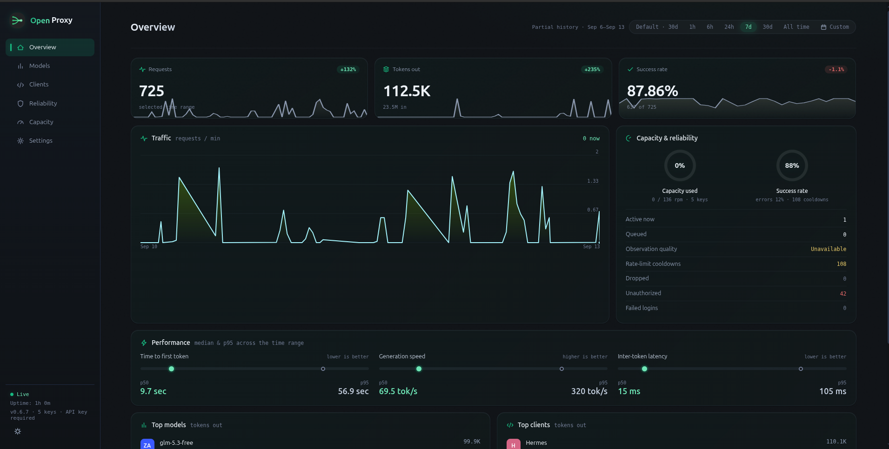
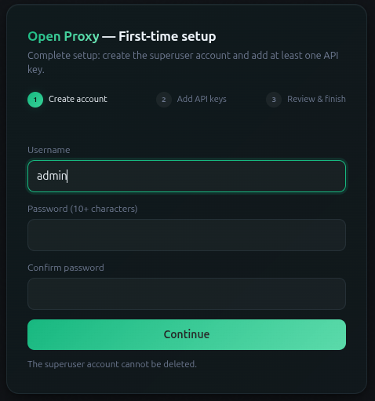
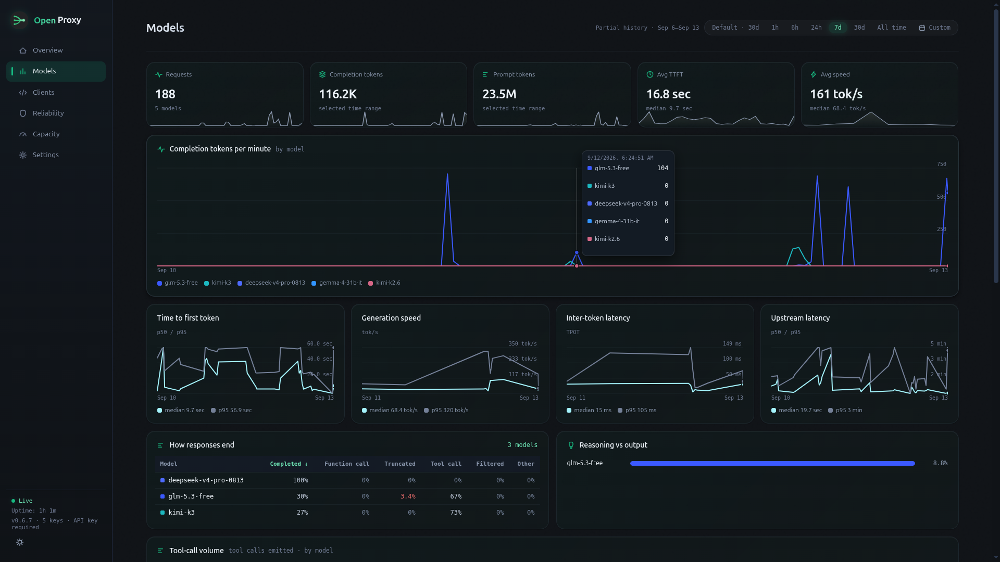
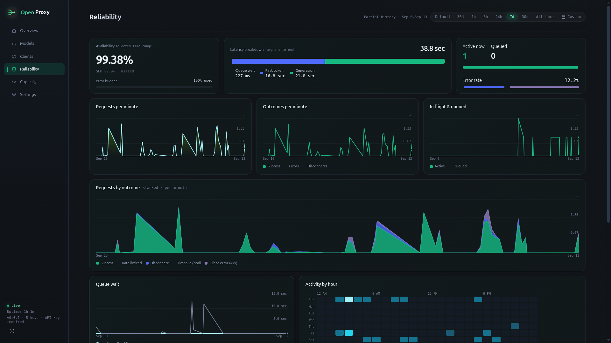
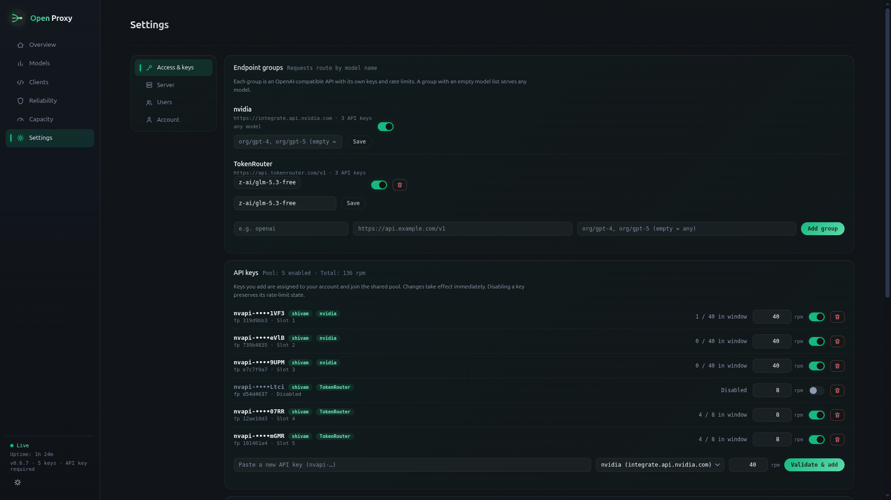

<div align="center">


# open-proxy

**A tiny, multi-provider, rate-limit-aware OpenAI-compatible proxy. One proxy, every provider, zero 429s.**
Add API keys from NVIDIA NIM, OpenRouter, TokenRouter, OpenAI, or any OpenAI-compatible API — open-proxy merges them into a single pool, obeys every upstream's speed limit, and keeps your clients running.

[](https://github.com/miztertea/nim-proxy/actions/workflows/ci.yml)
[](https://github.com/miztertea/nim-proxy/releases/latest)
[](https://scorecard.dev/viewer/?uri=github.com/miztertea/nim-proxy)
[](https://www.bestpractices.dev/projects/13484)
[](LICENSE)



</div>

---

Every upstream provider has its own rate limits — typically 40 requests per minute per API key. When a client (OpenCode, Codex, n8n, or anything that speaks the OpenAI API) hits that limit, the upstream returns a 429 and most clients simply abort the task. open-proxy sits in between and makes the limit invisible:

```
OpenCode ─┐
Codex     ├──► open-proxy ──┬─► integrate.api.nvidia.com   (NIM free tier)
n8n       ┘    │             ├─► openrouter.ai/api/v1       (OpenRouter)
               │             ├─► api.tokenrouter.com         (TokenRouter)
               │             └─► api.openai.com/v1           (OpenAI)
               │
               ├─ paces requests per key (sliding window, respects each upstream's limit)
               ├─ load-balances across all your keys and providers
               ├─ pins each conversation to one key (prefix-cache affinity)
               ├─ rides out 429/5xx with retries + Retry-After
               ├─ adapts to per-model worker-concurrency ceilings
               ├─ keeps client connections alive with SSE heartbeats
               ├─ answers /v1/models from cache (catalog polls cost nothing)
               └─ dashboard + Prometheus metrics for everything above
```

The more keys you add, the higher your combined throughput: 3 NIM keys (120 RPM) + 5 OpenRouter keys (200 RPM) = **320 RPM** total, automatically distributed. Each key holds to its own upstream's limit; the proxy just makes agents patient enough to live within the budget. Load-tested to prove it: 100 concurrent clients, zero upstream rate violations.

## Quick start

**1. Get API keys.** Sign up with any supported provider and grab an API key:

| Provider | Sign up | Key format | Free tier |
|---|---|---|---|
| **NVIDIA NIM** | [build.nvidia.com](https://build.nvidia.com) | `nvapi-…` | Yes — 40 RPM/key |
| **OpenRouter** | [openrouter.ai](https://openrouter.ai) | `sk-or-…` | Credit-based |
| **TokenRouter** | [tokenrouter.com](https://tokenrouter.com) | varies | Yes |
| **OpenAI** | [platform.openai.com](https://platform.openai.com) | `sk-…` | Pay-as-you-go |
| **Self-hosted** | your server | varies | Any OpenAI-compatible API |

You'll paste keys into the setup wizard — never into a file. Add as many providers and keys as you like; they all merge into one pool.

**2. Run the proxy.** The image is multi-arch, ~5 MB, with hardened defaults and persistent history:

```sh
docker build -t open-proxy .
docker run -d --name open-proxy -p 127.0.0.1:8000:8000 -v open-proxy-data:/data \
  open-proxy
```

With a checkout you can also use compose (`docker compose up -d --build`), or skip Docker entirely (`cargo run --release`). The `.env` file is optional and holds only container-level vars — see [Configuration](#configuration).

```
   ___  ___ ___ _  _   ___ ___  _____  ____   __
  / _ \| _ \ __| \| | | _ \ _ \/ _ \ \/ /\ \ / /
 | (_) |  _/ _|| .` | |  _/   / (_) >  <  \ V /
  \___/|_| |___|_|\_| |_| |_|_\\___/_/\_\  |_|
```

**3. Claim it.** Open `http://localhost:8000/` — a fresh install runs the **first-run wizard**: create the superuser account, add at least one API key (validated live against the upstream), and finish. By default the wizard also mints your first **client API key** (`npk_…`) and ends on a connect panel with the base URL and key ready to copy — so your client works immediately.

<div align="center"></div>

> **The first visitor to a fresh install becomes the superuser** — finish the wizard as soon as the proxy is reachable (the boot log says so too). Until setup completes, `/v1` is closed (503) and browsers are sent to `/setup`.

**4. Point your client at it.** Base URL `http://localhost:8000/v1`, API key = the `npk_…` key from the wizard. Recipes below.

## Client recipes

Model IDs pass through verbatim — use any model ID your provider supports (or `curl localhost:8000/v1/models` to see the merged catalog). In **API key required** mode (stored as `keyed`, the default), clients authenticate with a client API key (`npk_…`) minted in the wizard or in Settings. In **Open (no authentication)** mode (stored as `open`), no client key is needed.

**OpenCode** — `opencode.json`:

```json
{
  "$schema": "https://opencode.ai/config.json",
  "provider": {
    "nim": {
      "npm": "@ai-sdk/openai-compatible",
      "name": "OpenProxy (proxied)",
      "options": {
        "baseURL": "http://localhost:8000/v1",
        "apiKey": "npk_your-key-here",
        "timeout": false
      },
      "models": {
        "moonshotai/kimi-k2-instruct": { "name": "Kimi K2 Instruct" },
        "deepseek-ai/deepseek-r1": { "name": "DeepSeek R1" }
      }
    }
  }
}
```

Set `options.timeout: false` so OpenCode waits through the proxy's rate-limit heartbeats instead of aborting. For a complete config tuned for **GLM-5.2** (context, compaction, sampling), copy [`examples/opencode.json`](examples/opencode.json) — see [`examples/README.md`](examples/README.md) for the rationale behind each setting.

**Codex CLI** — `~/.codex/config.toml`:

```toml
model_provider = "nim"
model = "moonshotai/kimi-k2-instruct"

[model_providers.nim]
name = "OpenProxy (proxied)"
base_url = "http://localhost:8000/v1"
env_key = "OPENPROXY_API_KEY"   # export OPENPROXY_API_KEY=npk_your-key-here
wire_api = "chat"
```

**n8n** — add an *OpenAI* credential with Base URL `http://localhost:8000/v1` and your `npk_…` key, then use it in AI nodes with a model ID from your provider.

**Plain curl**:

```sh
curl http://localhost:8000/v1/chat/completions \
  -H 'Content-Type: application/json' \
  -H 'Authorization: Bearer npk_your-key-here' \
  -d '{"model":"deepseek-ai/deepseek-r1","stream":true,
       "messages":[{"role":"user","content":"hello"}]}'
```

For benchmarks or bounded jobs, add
`X-Nim-Proxy-Deadline-Ms: <milliseconds>`. This is an absolute wall-clock
deadline across proxy queueing, retries, and generation; heartbeats and output
chunks do not reset it. Buffered requests expire with HTTP 504 and error code
`deadline_exceeded`. Streaming requests have already committed HTTP 200, so
they receive the same code in a terminal SSE error event. Requests without the
header retain the proxy's normal patient behavior.

## The dashboard

Served at `GET /` — a compile-time embedded page with same-origin CSS,
JavaScript, and catalogs, but no Grafana or frontend build. Because the proxy
sits in the request path for every client and model,
it doubles as a **benchmarking and agent-observability tool**: it sees how
tool-heavy each client is, how deep its conversations run, how it tunes
sampling, where models truncate, and how much "thinking" a reasoning model
burns — all from counts and sizes, never message content.

<div align="center"></div>

Five persona-aligned tabs, each ordered at-a-glance → trends → detail:

- **Overview** — the one-screen landing: capacity and success-rate ring gauges, request and token sparklines, a health strip, and top models & clients.
- **Models** — ranked model cards, TTFT / generation-speed / inter-token-latency / upstream-latency charts, tokens-per-minute, tool-call volume, truncation and reasoning-share breakdowns, and a head-to-head scorecard.
- **Clients** — what each agent is *doing*: tool intensity, conversation depth, sampling fingerprint, requested output budget, streaming-vs-buffered mix, and a per-client leaderboard.
- **Reliability** — availability against the configured SLO (99.9% by default) with an error budget, requests-by-outcome over time, a latency breakdown (queue / first token / generation), an error taxonomy, an hour-of-day heatmap, and a model-limits card when the governor engages.
- **Capacity** — a **Now** saturation bar, historical utilization against the capacity configured at each sample, an exact peak-RPM shortfall, per-key utilization meters, and 429s-per-minute by key.

<div align="center"></div>

Every line chart has a hover crosshair with a per-series tooltip; every table is click-to-sort and survives the 3-second live refresh.

**Time ranges & history.** Persisted server history drives every analytical
tab. The default view follows now across the configured default time range
(30 days by default), so a new server grows naturally from its first sample
instead of opening on an empty recent slice. The same global selection follows
you through Overview, Models, Clients, Reliability, and Capacity. Presets
include 1h/6h/24h/7d/30d and **All time**; a custom range or the pause
control freezes the analytical time range while current operational values marked
**Now** keep refreshing. Exact totals do not depend on chart point density.

The default time range and data retention are separate Server settings. Both
default to 30 days; retention may be longer than the default view, and `0`
means unlimited. A finite retention window cannot be shorter than the default
view. Real history size depends on metric and label cardinality—the old
fixed-size estimate was wrong—so monitor the displayed history-file size for
your workload.

**Settings.** Everything app-level is managed here: endpoint groups (each an
OpenAI-compatible API with its own keys and rate limits), upstream API keys (per-key
rpm, enable/disable, group assignment), model routing (per-group allowlists
plus global model toggles), client API keys, the API authentication mode,
upstream URL, limits, default time range, history retention, availability
SLO, model limits, and users. Saves validate, persist, and apply
live. The config file itself is read at boot; an out-of-band edit to
`DATA_DIR/config.json` requires a restart.

<div align="center"></div>

## How it works

- **One rate window per key.** Each API key gets an exact sliding-window limiter (configurable per key, defaulting to 40 requests per rolling 60 s — matching common upstream limits, not a burstable token bucket — plus a 1 s jitter margin so boundary-timed requests can't land inside the upstream's window).
- **One queue for all clients.** Any number of clients share the key pool through a global FIFO dispatcher: slots are granted strictly in arrival order, no client can starve another, and a client that disconnects while queued returns its slot.
- **Sticky conversations, spread bursts.** Each conversation prefers the same key every turn, keeping any server-side prefix cache warm. When that key is full the request spills to the least-loaded ready key — the API is stateless, so crossing keys is always safe, just potentially a cold cache.
- **Heartbeats instead of failures.** For streaming requests the proxy commits to `200 text/event-stream` immediately and emits SSE comment lines (`: heartbeat` — ignored by every OpenAI client) while it waits for a slot or rides out upstream 429/500/502/503/504 with `Retry-After` honored and instant failover between keys. Streams that stall mid-generation are cut after the `stream_idle` limit.
- **Optional absolute deadlines.** `X-Nim-Proxy-Deadline-Ms` bounds the whole request independently of heartbeats or socket activity. Expiry cancels queue/retry/upstream work and releases its key, model, and in-flight ownership.
- **Model-pressure aware.** Some providers cap per-model worker concurrency independently of the per-key rate limit; the proxy detects that specific exhaustion, backs off the affected *model* adaptively (never wasting healthy key capacity on failover), and surfaces it on the dashboard — see [architecture: governor](knowledge/architecture/governor.md).
- **Pass-through with one exception.** Bodies are forwarded untouched, except: streaming chat requests get `stream_options: {"include_usage": true}` injected so token accounting is exact rather than estimated. If a model rejects the field, the proxy retries untouched and never injects for that model again. `strict_passthrough` in Settings disables injection entirely.
- **Local answers where possible.** `GET /v1/models` is cached (10 min default, single-flight refresh), so client catalog polls don't burn rate budget. With several endpoint groups the catalog fans out (one slot per group that has a key) and merges by model id, minus globally disabled models.

## Configuration

App-level configuration lives in the dashboard (Settings) and persists to
`DATA_DIR/config.json`. Settings saves apply live; the file is otherwise read
at boot, so manual or automated out-of-band edits require a restart.
Environment variables cover container-level concerns only:

| Variable | Default | Purpose |
|---|---|---|
| `HOST` / `PORT` | `0.0.0.0` / `8000` | Bind address and port |
| `DATA_DIR` | `data` (`/data` in Docker) | Where the config store and canonical `history-v1.jsonl` live; must be writable (an unwritable dir is a hard boot error) |
| `TRUST_PROXY` | `false` | Trust `X-Forwarded-Proto` and mark the session cookie `Secure` (set behind a TLS-terminating reverse proxy) |
| `RUST_LOG` | `nim_proxy=info` | Log filter |

Docker Compose also reads `PUBLISH_HOST` from `.env` for the host-side port
publish. It defaults to `127.0.0.1`; set `PUBLISH_HOST=0.0.0.0` only when the
deployment is ready for LAN/public reachability. This is a Compose setting,
not an environment variable consumed by the proxy.

Everything else is a Settings control: endpoint groups (each an
OpenAI-compatible API with its own base URL, keys, enable toggle, and model
allowlist), upstream API keys (per-key rpm,
enable/disable, ownership, group assignment), model toggles (globally
disabled models are hidden from the merged `/v1/models` catalog and rejected
with `model_disabled` before queueing), the upstream base URL (the primary
group's), client API keys and the API authentication
mode (`keyed`/`open` in stored config), limits (`max_wait`, `heartbeat`,
`stream_idle`, `request_timeout`, `models_ttl`, `max_inflight`,
`strict_passthrough`), default time range, history retention, availability SLO,
model limits, and users & roles.

Requests route by model name: a model pinned in a group's allowlist is served
only by that group; any other model falls back to the groups with an empty
allowlist (catch-alls). A model no enabled group carries is a `404
model_not_found`, not a wait-until-timeout.

## Security & deployment

The proxy **fails closed**. Before setup, the data plane is closed (`/v1` → `503 setup_required`) and browsers are sent to the wizard. After setup, the dashboard and all observability **always** require a logged-in user; `/v1` is either **API key required** (`keyed`) or **Open (no authentication)** (`open`). Credentials live in the config store on the data volume (`config.json`, mode 0600) — not in env vars.

### Users & roles

The wizard creates the **superuser** — an admin that can never be deleted (so the last admin can't vanish). From Settings → Users, admins add more users:

- **superuser** — an admin; the one account that can't be deleted, and it always owns ≥1 enabled API key (the pool floor).
- **admin** — server settings + user management.
- **user** — own account, own client API keys, own upstream API keys. Sees every dashboard tab (identical for all roles) but only their own key rows.

That last role is the shared-pool model: a friend adds their API key to the pool and mints their own client key; nobody else — not even an admin — can ever see either value.

Login is username + password → a signed, HttpOnly, SameSite=Strict session cookie. Changing or resetting a password logs that user's other sessions out instantly; deleting a user kills their sessions, pulls their API keys from the pool, and revokes their client keys. Passwords are PBKDF2-HMAC-SHA256 (600k iterations). Forgot a password? Any admin resets it (except the superuser's — that one only rotates via its own Account page). Locked out entirely? Stop the container, empty the `"users"` array in `config.json` on the volume, restart — the wizard re-creates the superuser and keys/settings survive.

### `/v1` API authentication

- **API key required** (`keyed`, default) — clients send `Authorization: Bearer <npk_…>`. Each user mints their own client keys; a key's 128-bit secret is shown **exactly once** (only its SHA-256 digest + last-4 are stored). This mode with zero client keys rejects everything (fail closed). Unknown keys get an OpenAI-style 401; comparison is constant-time.
- **Open (no authentication)** (`open`) — `/v1` is unauthenticated. Only for loopback or a fully private network. This toggle affects **only `/v1`** — the dashboard is never open.

The compose file publishes `127.0.0.1:8000:8000` by default so a bare
bring-up can't leak. Set `PUBLISH_HOST=0.0.0.0` in `.env` when intentional
LAN/public exposure is protected appropriately.

### Scrapers

Prometheus scrapes `/metrics` with `Authorization: Bearer <username>:<password>` (or HTTP Basic) for any dashboard user:

```yaml
scrape_configs:
  - job_name: open-proxy
    authorization: { credentials: "<username>:<password>" }
    static_configs: [{ targets: ["open-proxy:8000"] }]
```

`/health` stays public (load-balancer / Docker probe; exposes nothing).

### The dashboard API

The routes the dashboard and the setup wizard call are described by
[`openapi.json`](openapi.json) at the repo root — 17 operations covering 15
`/api/*` routes plus the two unauthenticated `/setup` ones. The public
`GET /api/locale-bootstrap` operation and both setup operations explicitly
waive the document-level authentication requirement; the other 14 `/api/*`
operations require operator authentication. The spec is
**generated from the handlers** (`utoipa`) and CI fails on any drift, so it
cannot describe a version of the API that no longer exists. Point any offline
viewer or client generator at it; nothing is served at runtime, which keeps
the Content-Security-Policy strict and the image a single static binary.

The OpenAI-compatible `/v1` surface is deliberately not in there — that
contract is your upstream provider's, and open-proxy passes it through.

### Deployment patterns

| Pattern | How |
|---|---|
| **Local self-host** | Keep the default loopback port publish; switch to **Open (no authentication)** in Settings if you don't want client keys. |
| **VPS / bare metal** | A TLS-terminating reverse proxy (nginx/Caddy) in front; keep **API key required**. Set `TRUST_PROXY=true` so the session cookie is marked `Secure`. |
| **PaaS (ECS / Railway / Fly)** | The platform edge terminates TLS. Set `TRUST_PROXY=true`. Complete the wizard as soon as the instance is reachable. |

**TLS is not built in** — passwords and keys must travel over HTTPS, so terminate TLS at a reverse proxy or platform edge for any exposed deployment. Additional hardening in place: a strict `Content-Security-Policy` and anti-framing/sniffing headers on all responses, a failed-login throttle, and an in-flight cap (`max_inflight`) that sheds floods with a 503.

### Supply chain

The build and release path is hardened to the OpenSSF baseline (scored weekly by the [Scorecard badge](https://scorecard.dev/viewer/?uri=github.com/miztertea/nim-proxy) above): every GitHub Actions step is SHA-pinned, CI runs **CodeQL** static analysis, workflow linting (`actionlint` + `zizmor`), dependency review, and `cargo-deny` (advisories on every PR plus a weekly audit), and the untrusted-byte parsers are **fuzzed** weekly. Releases are signed with keyless [cosign](https://docs.sigstore.dev/): the multi-arch image carries a signature, SLSA build provenance, and an SPDX SBOM, and the downloadable tarballs + SBOM each ship a `.sigstore.json` bundle you can check with `cosign verify-blob` (the exact command is in every release's notes). Published `v*` tags are protected against retagging.

## Operations

- **Image**: built `FROM scratch` — a ~5 MB static musl binary with TLS roots compiled in. No shell, no libc, no CA bundle. Runs as a non-root UID with `read_only`, `cap_drop: ALL`, `no-new-privileges`; rootless Docker/Podman compatible.
- **Healthcheck**: the binary doubles as its own probe (`open-proxy --health`); `docker ps` shows `healthy`.
- **Logs**: the ASCII banner + structured startup detail, then one access line per request (`200 alice model /v1/chat/completions (3210 ms)`). ANSI color is TTY-detected, so `docker logs` stays clean.
- **Metrics**: Prometheus exposition at `GET /metrics` (scrapeable by any OTel collector's Prometheus receiver). Full series list below.
- **Shutdown**: SIGTERM and SIGINT both drain gracefully.

<details>
<summary><b>Full metric reference</b> (click to expand)</summary>

| Metric | Labels | Meaning |
|---|---|---|
| `nimproxy_requests_total` | client, model, path, status | Every request (`status` includes `disconnect`, `stall`, `stream_error`, `deadline`) |
| `nimproxy_deadline_exceeded_total` | client, model, path | Requests stopped by `X-Nim-Proxy-Deadline-Ms` |
| `nimproxy_prompt_tokens_total` | client, model | Prompt tokens, from upstream `usage` |
| `nimproxy_completion_tokens_total` | client, model, source | Completion tokens; `usage` = exact, `estimate` = per-SSE-event fallback |
| `nimproxy_ttft_seconds` | model | Upstream send → first streamed byte |
| `nimproxy_tokens_per_second` | model, source | Generation speed |
| `nimproxy_tpot_seconds` | model | Mean inter-token latency (time per output token) |
| `nimproxy_upstream_seconds` | model | Upstream latency (streaming + non-streaming) |
| `nimproxy_finish_reason_total` | model, reason | How generations end; `length` = truncation |
| `nimproxy_tool_calls_total` | model | Tool calls emitted |
| `nimproxy_reasoning_tokens_total` | model | Reasoning ("thinking") tokens, from `usage` details |
| `nimproxy_usage_observations_total` | field, result | Usage-field quality: measured, estimated, unavailable, or invalid |
| `nimproxy_stream_requests_total` | client, stream | Requests per client, streaming vs buffered |
| `nimproxy_request_messages` | client | Conversation depth per request (histogram) |
| `nimproxy_request_tools` | client | Tools offered per request (histogram) |
| `nimproxy_request_max_tokens` | client | Requested output cap (histogram) |
| `nimproxy_request_temperature` | client | Sampling temperature (histogram) |
| `nimproxy_tool_choice_total` | mode | Tool-selection mode: `auto`/`none`/`required`/`named` |
| `nimproxy_json_mode_total` | client | Structured-output (JSON-mode) requests |
| `nimproxy_queue_wait_seconds` | — | Time waiting for a rate-limit slot |
| `nimproxy_queue_depth` / `nimproxy_active_requests` | — | Live load gauges |
| `nimproxy_lane_requests_total` | lane | Requests per key lane |
| `nimproxy_lane_cooldown_total` | lane, status | Upstream 429/5xx/connect per lane |
| `nimproxy_affinity_total` | result | Conversation routing: `sticky` / `spill` / `none` |
| `nimproxy_unauthorized_total` | — | Rejected API requests |
| `nimproxy_login_failures_total` | — | Failed dashboard logins |
| `nimproxy_shed_total` | — | Requests shed at the in-flight cap |
| `nimproxy_worker_exhausted_total` | model | Per-model worker-concurrency exhaustion events (when the upstream enforces it) |
| `nimproxy_model_inflight` | model | Requests in flight per model (governor gauge) |
| `nimproxy_model_limit` | model | Current per-model concurrency cap; `0` = ungoverned |

Request shape (messages, tools, sampling params) is captured as **counts and sizes only — never message content**. The `model` and `path` labels are sanitized (safe charset, length-capped) and `model` cardinality is bounded; `reason`, `mode`, and `stream` are fixed enums — so untrusted clients can't inject into the exposition format or explode the registry.

</details>

## Testing

Four layers (unit, end-to-end, load, fuzz), all runnable locally:

```sh
cargo test          # unit + end-to-end tests (real binary vs a scripted mock upstream)
```

The e2e suite covers auth (client keys, multi-user login, role and ownership enforcement, the fail-closed setup posture and the wizard), the config store (round-trip across restart, atomic saves, refusal on corrupt/future-version stores), 429 ride-out with key failover, per-model worker-exhaustion governing, Retry-After timing, pacing enforcement (including live pool rebuilds mid-run), conversation affinity, models caching, usage injection, stalled-stream recovery, label-injection sanitizing, security headers, metrics accuracy, history persistence across restart, and SIGTERM.

Load test — 100 concurrent clients against a mock that *strictly enforces* the upstream's per-key window and counts violations (`--worker-slots` also emits per-model worker-exhaustion errors so the governor is exercised):

```sh
python3 scripts/mock_nim.py --enforce --rpm 40 --worker-slots 32 --port 9999 &
cargo run --release &     # complete the wizard against http://127.0.0.1:9999
python3 scripts/loadtest.py --clients 100 --requests 3
```

It exits non-zero on any client-visible failure or a single upstream rate violation, and reports worker exhaustions + peak per-model concurrency. See [`knowledge/testing/test-strategy.md`](knowledge/testing/test-strategy.md) for the full strategy and [CONTRIBUTING.md](CONTRIBUTING.md) for the development workflow.

## Upgrading to 0.6.6

Back up the data volume before upgrading; it contains `config.json`, API
keys, password hashes, and client API-key digests. Then pull and restart as
usual (`docker compose pull && docker compose up -d`, or replace the image in
your existing `docker run` deployment).

0.6.6 intentionally starts dashboard history over in the canonical
`DATA_DIR/history-v1.jsonl` format. It does not read, rename, truncate, migrate,
or delete the experimental `DATA_DIR/history.jsonl`; the old file remains
available for rollback and may be removed manually after you no longer need
it. Historical charts begin with post-upgrade data.

Also update dashboards, alerts, or recording rules from
`nimproxy_lane_benched_total` to `nimproxy_lane_cooldown_total`. Pricing
settings and estimated-savings fields are removed; an existing `pricing`
config block is ignored. The config store remains schema v1; the new server
locale defaults to `en-US`, and each user's optional locale defaults to no
override.

The 0.6.6 interface ships in `en-US` only. Locale preference and server-default
API contracts are present for forward compatibility, but the only installed
production locale is `en-US`; the generated `en-XA` pseudolocale is test-only.

## FAQ & limitations

- **Is this against my provider's ToS?** It's designed not to be. The proxy never exceeds any key's rate limit — that's its entire purpose. Keys are issued per developer account; whether you pool keys with others is between you and the provider's terms — the proxy just guarantees each key behaves.
- **Non-streaming requests can't be heartbeated** (no wire format for it) — they wait silently through pacing/retries up to the `max_wait` limit. Agent clients normally stream, so this rarely matters.
- **One instance per key set.** Rate state is in-memory; two replicas sharing keys would each assume the full 40 RPM. Run one instance (it comfortably saturates far more keys than you can register).
- **Rate windows reset on restart.** A restart right after heavy traffic can draw a burst of 429s — the retry machinery absorbs them invisibly.
- **Dashboard history is sample-precise, not event-precise.** Following,
  fixed, and All-retained views can all be rebuilt from server history after
  refresh/restart, though the UI selection itself resets to the default.
  Only adjacent-poll **Now** rates need two current samples.
- **"OTel metrics?"** Prometheus exposition format, which every OpenTelemetry collector ingests natively (`prometheus` receiver).
- **No built-in TLS.** Terminate TLS at a reverse proxy or platform edge for any exposed deployment; set `TRUST_PROXY=true` so session cookies are marked `Secure`.
- **Sessions reset on restart.** The cookie signing key is random per boot, so a restart logs everyone out of the dashboard (API keys are unaffected).

## Project knowledge base

The `knowledge/` directory holds the project's long-term memory — design decisions with their reasoning, research about upstream providers, per-component architecture notes, and runbooks, all cross-linked markdown. Start at [`knowledge/index.md`](knowledge/index.md). [`AGENTS.md`](AGENTS.md) tells AI agents how to maintain it.

## Contributing, security & support

- **Contributing** — PRs welcome; read [CONTRIBUTING.md](CONTRIBUTING.md)
  first (build/test commands, the knowledge-base rules, and the zero-warning
  bar). For anything beyond a small fix, open an issue before writing code.
- **Security** — report vulnerabilities privately via
  [SECURITY.md](SECURITY.md), never in a public issue.
- **Support** — questions go to
  [Discussions](https://github.com/miztertea/nim-proxy/discussions); see
  [SUPPORT.md](SUPPORT.md) for the routing map.

## License

MIT — see [LICENSE](LICENSE).
